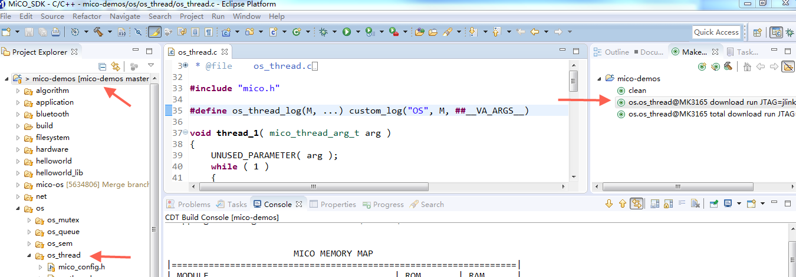
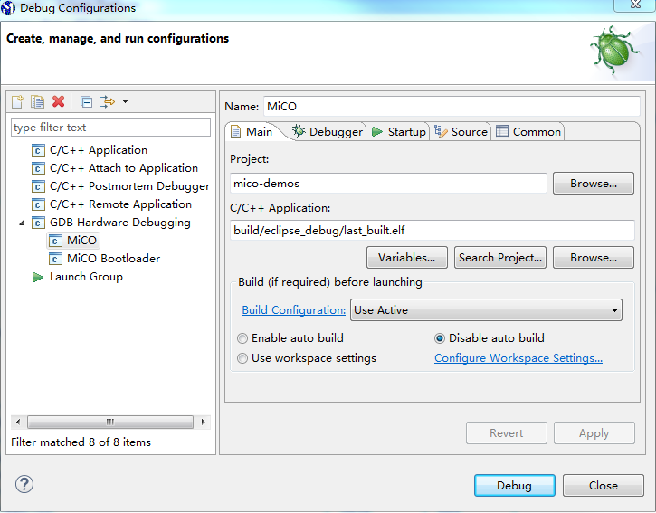
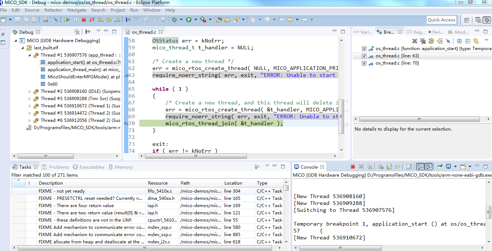

mico-demos
====
包含：一系列基于MiCO的示例程序。

###目录
* algorithm：安全和校验算法示例程序，如：MD5，AES,CRC16等。
* application：应用程序示例程序，如：wifi_uart透传程序，苹果homekit等。
* bluetooth：蓝牙功能相关的示例程序，如：蓝牙center，蓝牙sensor和蓝牙设备扫描等。
* filesystem：文件系统读写功能示例程序。
* hardware：硬件外设控制实现示例程序。
* helloworld：MiCO最简单的入门级应用程序。
* net：网络通信功能示例程序，如：dns域名解析，http通信，tcp客户端创建及通信等。
* os：操作系统功能示例程序，如：多线程，信号量，互斥锁，定时器和队列。
* parser：解析器功能示例程序，如:JSON解析，url解析。
* power_measure: MiCO设备低功耗功能实现示例程序。
* test：功能测试示例程序，如：iperf等。
* wifi：无线wifi功能实现示例程序，如：wifi扫描，softap建立，station建立等。


### 使用前准备
1. 首先您需要安装 [mico-cube](https://code.aliyun.com/mico/mico-cube).
2. 安装MiCoder IDE集成开发环境，下载地址：[MiCoder IDE](http://developer.mico.io/downloads/2)；
3. 准备一个Jlink下载调试工具(针对ST开发板，可使用Stlink)，并在PC上安装Jlink驱动软件；
4. 连接Jlink工具到PC端，并更新驱动程序，具体方法参考：[MiCO SDK 使用](http://developer.mico.io/docs/10)页面中步骤 1；
5. 使用USB线连接PC和MiCOKit，实现一个虚拟串口用于供电和输出调试信息, 驱动下载地址：[VCP driver](http://www.ftdichip.com/Drivers/VCP.htm)；

###导入工程
通过系统命令行，从git仓库中导入mico-demos文件夹：
```
mico import mico-demos
cd mico-demos
```
###编译工程
以 MiCOKit-3165 开发板为例,helloword 和 os_thread 工程的 mico-cube 编译命令如下：
```
mico make helloworld@MK3165
mico make os.os_thread@MK3165
```
您的电脑将花费几分钟来完成编译，完成后会显示如下结果：
```
[snip]
                        MICO MEMORY MAP                            
|=================================================================|
| MODULE                                   | ROM       | RAM      |
|=================================================================|
| App_os_thread                            | 625       | 0        |
| Board_MK3165                             | 1282      | 124      |
| crt0_GCC                                 | 212       | 0        |
| FreeRTOS                                 | 5434      | 424      |
| hardfault_handler                        | 991       | 0        |
| libc                                     | 27504     | 2260     |
| libgcc                                   | 3136      | 0        |
| Lib_dc_motor_MK3165                      | 30        | 0        |
| Lib_gpio_button_MK3165                   | 228       | 200      |
| Lib_MiCOKit_EXT_MK3165                   | 452       | 7        |
| Lib_MiCO_Kernel                          | 12        | 12       |
| Lib_MiCO_System                          | 2072      | 88       |
| Lib_MiCO_System_QC                       | 1311      | 80       |
| Lib_RGB_P9813_MK3165                     | 144       | 0        |
| Lib_SPI_Flash_Library_MK3165             | 904       | 0        |
| Lib_Utilities                            | 320       | 0        |
| Lib_VGM128064_MK3165                     | 2268      | 0        |
| Lib_wolfSSL.Cortex-M4.GCC.release        | 12817     | 8        |
| LwIP                                     | 28        | 0        |
| mem_newlib                               | 44        | 0        |
| MiCO.3165.GCC                            | 87666     | 27791    |
| MiCO_FreeRTOS_Interface                  | 2717      | 36       |
| mico_system_power_daemon                 | 653       | 25       |
| platform_vector_table                    | 0         | 0        |
| Sensor_APDS9930_MK3165                   | 1091      | 6        |
| Sensor_BME280_MK3165                     | 2516      | 70       |
| Sensor_DHT11_MK3165                      | 152       | 0        |
| Sensor_Infrared_Reflective_MK3165        | 20        | 0        |
| Sensor_Light_adc_MK3165                  | 20        | 0        |
| stdio_newlib                             | 108       | 0        |
| STM32F4xx                                | 5067      | 2215     |
| STM32F4xx_Peripheral_Drivers             | 8810      | 232      |
| STM32F4xx_Peripheral_Libraries           | 4950      | 16       |
| *fill*                                   | 183       | 913      |
|=================================================================|
| TOTAL (bytes)                            | 173767    | 34507    |
|=================================================================|
```

####下载工程至开发板
1. 通过USB线，将开发板连接至电脑。
2. 通过JLINK，将开发板的JTAG端口连接电脑。（还支持的仿真器包括STLINK, CMSIS-DAP etc）。
3. 通过 mico-cube 命令下载固件：
```
mico make os.os_thread@MK3165 download run JTAG=jlink_swd
```
下载完成后，开发板调试串口将输出线程创建log信息。如:
```
[12024][OS: os_thread.c:  42] This is thread 1
[12030][OS: os_thread.c:  50] This is thread 2
[14028][OS: os_thread.c:  42] This is thread 1
[16032][OS: os_thread.c:  42] This is thread 1
[16040][OS: os_thread.c:  50] This is thread 2
[18036][OS: os_thread.c:  42] This is thread 1
```
注意：若您首次下载该开发板固件，请在编译命令中使用total指令，以下载完整固件。如：
```
mico make os.os_thread@MK3165 total download run JTAG=jlink_swd
```

####在 MiCoder IDE 中编译，下载与调试工程
1. 打开 MiCoder IDE.
2. 导入 mico-demos 项目，步骤：import->General->Existing Projects into Workspace.
3. 在 make target 窗口输入编译下载命令，并下载固件至开发板.
4. 选择当前调试工程“mico-demos”，步骤：





###故障排除

请确认您的mico-cube工作在最新版本，当前最新版本为：1.0.4。请使用以下命令查询：
```
 mico --version
```
如不是最新版本，可使用以下命令更新：
```
 mico upgrade
```

mico-demos
====
This file includes a series of sample programs for MiCO.

### Contents
* algorithm: Security and checksum algorithm usage sample programs including MD5,AES,CRC16 and so on.
* application: Integrated application sample programs including wifi_uart, homekit and so on.
* bluetooth: Bluetooth function related sample programs including ble_center, ble_sensor, ble_scan and so on. 
* filesystem: How to use the file system to read and write operations.
* hardware: Hardware control function sample programs including dc_motor, light_sensor, oled, rgb_led and so on.
* helloworld: The simplest application program for MiCO.
* net: Network communication function sample programs including dns,http,tcp_client and udp_unicast and so on.
* os: Operating system function sample program including thread, mutex, sem, queue and timer.
* parser: Protocol analytic sample programs including json, url and so on.
* power_measure: Show how to set device to low power mode in MiCO.
* test: Some function test sample programs including iperf, spi_flash_test and so on.
* wifi: WiFi Sample programs including wifi_scan, soft_ap and station and so on.


### Preparations:
1. You should install [mico-cube](https://code.aliyun.com/mico/mico-cube?spm=a2111a.8458726.0.0.j0sX0w)
2. Install MiCoder IDE and download address: [MiCoder IDE](http://developer.mico.io/downloads/2);
3. Prepare a Jlink tool (for ST develpment board，use STlink)，and install its driver；
4. Connect Jlink to PC, and update its driver following the step 1 in [Jlink driver update](http://developer.mico.io/docs/10)；
5. Connect USB cable to PC to have a virtual serial port, install [VCP driver](http://www.ftdichip.com/Drivers/VCP.htm)；

###Import project
Through command line, import "mico-demos" from git repertory.
```
mico import mico-demos
cd mico-demos
```
###Compile project
Take MiCOKit-3165 board as example, mico-cube compile commands for helloword and os_thread are as following:
```
mico make helloworld@MK3165
mico make os.os_thread@MK3165
```
Your computer will take a few minutes to complete the compilation, the results will be displayed as follows:
```
[snip]
                        MICO MEMORY MAP                            
|=================================================================|
| MODULE                                   | ROM       | RAM      |
|=================================================================|
| App_os_thread                            | 625       | 0        |
| Board_MK3165                             | 1282      | 124      |
| crt0_GCC                                 | 212       | 0        |
| FreeRTOS                                 | 5434      | 424      |
| hardfault_handler                        | 991       | 0        |
| libc                                     | 27504     | 2260     |
| libgcc                                   | 3136      | 0        |
| Lib_dc_motor_MK3165                      | 30        | 0        |
| Lib_gpio_button_MK3165                   | 228       | 200      |
| Lib_MiCOKit_EXT_MK3165                   | 452       | 7        |
| Lib_MiCO_Kernel                          | 12        | 12       |
| Lib_MiCO_System                          | 2072      | 88       |
| Lib_MiCO_System_QC                       | 1311      | 80       |
| Lib_RGB_P9813_MK3165                     | 144       | 0        |
| Lib_SPI_Flash_Library_MK3165             | 904       | 0        |
| Lib_Utilities                            | 320       | 0        |
| Lib_VGM128064_MK3165                     | 2268      | 0        |
| Lib_wolfSSL.Cortex-M4.GCC.release        | 12817     | 8        |
| LwIP                                     | 28        | 0        |
| mem_newlib                               | 44        | 0        |
| MiCO.3165.GCC                            | 87666     | 27791    |
| MiCO_FreeRTOS_Interface                  | 2717      | 36       |
| mico_system_power_daemon                 | 653       | 25       |
| platform_vector_table                    | 0         | 0        |
| Sensor_APDS9930_MK3165                   | 1091      | 6        |
| Sensor_BME280_MK3165                     | 2516      | 70       |
| Sensor_DHT11_MK3165                      | 152       | 0        |
| Sensor_Infrared_Reflective_MK3165        | 20        | 0        |
| Sensor_Light_adc_MK3165                  | 20        | 0        |
| stdio_newlib                             | 108       | 0        |
| STM32F4xx                                | 5067      | 2215     |
| STM32F4xx_Peripheral_Drivers             | 8810      | 232      |
| STM32F4xx_Peripheral_Libraries           | 4950      | 16       |
| *fill*                                   | 183       | 913      |
|=================================================================|
| TOTAL (bytes)                            | 173767    | 34507    |
|=================================================================|
```

###Programm your board
1. Make sure you have connected MiCO device to computer through USB line.
2. Make sure you have connected JTAG port of board to computer through JLINK Debug tool.(Debug tools also includes STLINK, CMSIS-DAP etc).
3. Program board with mico-cube command:
```
mico make os.os_thread@MK3165 download run JTAG=jlink_swd
```
After programming, the debug port of board will output log as:
```
[12024][OS: os_thread.c:  42] This is thread 1
[12030][OS: os_thread.c:  50] This is thread 2
[14028][OS: os_thread.c:  42] This is thread 1
[16032][OS: os_thread.c:  42] This is thread 1
[16040][OS: os_thread.c:  50] This is thread 2
[18036][OS: os_thread.c:  42] This is thread 1
```

Note：If you program the board for the first time, please add total in command line to program whole firmware.As following:

```
mico make os.os_thread@MK3165 total download run JTAG=jlink_swd
```

####Debug project in MiCoder IDE
1. Open MiCoder IDE.
2. Import "mico-demos" project，plese follow steps as：import->General->Existing Projects into Workspace.
3. Input compile and download command line in make target windows.
4. Choose the current debug project “mico-demos”，as following pictures:


###Troubleshooting

Make sure mico-cube is working correctly and its version is >1.0.4
```
 mico --version
```
If not, you can update it:
```
 mico upgrade
```